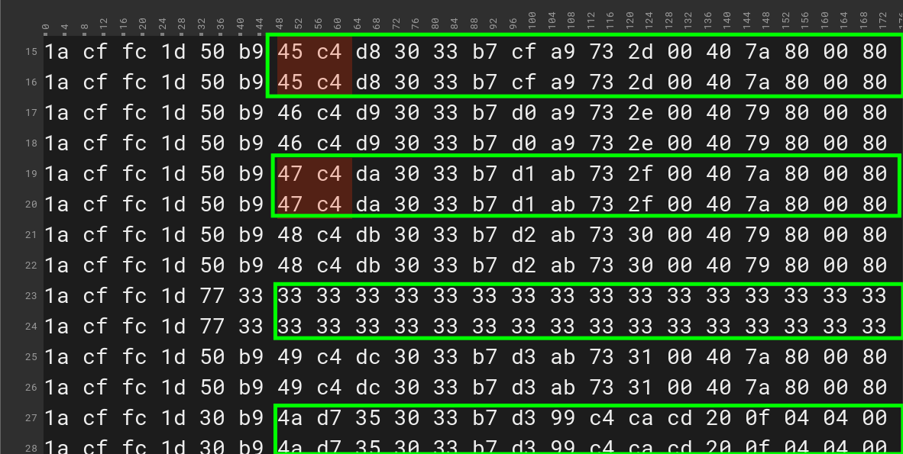

# GGAK Worky :3

Jul's, A-Where's, Dereksgc's Discord server community, and SatDump's team work on REing the GGAK format.

## Purpose

The purpose os this repository is to have a collaborative space where data, documents, and the RE work can be shared to people interested in helping the process, or that might just have interest in knowing the format.

### Repo's To Do List

- [-] Description of the format
- [-] Code for processing the data gathered from SatDump (or any other software)
- [ ] SatDump Plugin

## Frame Description

### Forward Error Correction (FEC)

When you think about FEC in satellite communications you'll probably think of Viterbi, Reed-Solomon, LDPC, Turbo, and other _fancy implementations_. But of course, The Russian engineers had to go galaxy brain 🧠 here, so they used a very ancient and widely known and used technique ~(maybe by the Egyptians, Romans, Incas, and Maias)~.

 

Of course that is "just send it twice to make sure", aka. the ✨**FEC-ski**:tm:✨. 🤫 _Because why would you even spend time reading about what Shannon, Hamming, and Golay did if you can just send the data twice to make sure everything got received as it should_ 🧠.

### Frame Format

- [32 bits] Standard CCSDS sync word `0x1ACFFC1D`
- [..?] Timestamp

- [last 16 bits] CRC 16

### "Official" sources for data corelation
- http://ipg.geospace.ru/electro-l2-skl.html
- https://ftp.sinp.msu.ru/electro_l2/skl
